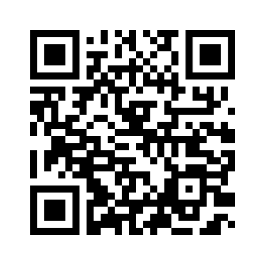

# QRCoder: High-Speed File Transfer via QR Code Video Stream



## Overview

QRCoder is an open-source solution for transferring data using animated QR code sequences, enabling file transfer through visible light communication. This technology facilitates transfers between devices without requiring network connections, USB cables, or traditional radio technologies (WiFi, Bluetooth).

## 🔑 Key Features

- **Offline Transfer**: Move data between devices without network access
- **Visual Data Transmission**: Transfer files using only a screen and camera
- **High Data Density**: Up to 32 QR codes per frame with grid layout support
- **Adaptive Sizing**: QR codes automatically scale to optimize screen utilization
- **Multi-QR Grid Layouts**: Support for 1×1, 2×1, 2×2, 4×2, 4×4, and 8×4 configurations
- **Unlimited File Size**: Set-based architecture with no practical file size limit
- **File Continuity**: Recognizes previously partially transferred files
- **Smart Processing**: Preliminary scan analysis for optimal frame detection
- **Selective Retransmission**: Identify and retransmit only missing sections
- **Cross-Platform**: Works on any device with a modern browser and camera

## 🚀 Use Cases

1. **Public Information Sharing**
   - Exchange data in areas with limited or no connectivity
   - Share educational materials in remote locations
   - Distribute information during natural disasters or emergencies

2. **Educational & Creative**
   - Demonstrate visual data communication principles
   - Create interactive exhibits showing visual data transfer methods
   - Teach coding and data communication concepts

3. **Accessibility Solutions**
   - Enable hands-free data transfers for users with mobility limitations
   - Provide alternative data access methods for diverse user needs
   - Simplify technology interactions for non-technical users

4. **Event & Conference Tools**
   - Exchange contact information or digital business cards
   - Share presentation materials with audience members
   - Enable interactive polling or feedback collection

5. **Field Work & Research**
   - Transfer collected data in remote research locations
   - Exchange information between field devices without connectivity
   - Back up critical information in challenging environments

6. **Legacy Device Support**
   - Transfer data to/from devices lacking modern connectivity options
   - Update older systems without traditional interfaces
   - Migrate information from obsolete technology

## 🔧 Technical Implementation

QRCoder consists of two main components:

### 1. Encoder (video-qr-encoder.html)

The encoder converts files into a sequence of QR codes displayed at adjustable speeds:

- **File Processing**: Reads files as binary data and converts to Base64
- **Chunking Algorithm**: Divides data into optimally sized chunks
- **Set-Based Architecture**: Organizes chunks into independently processable sets
- **Grid-Based Display**: Renders 1-32 QR codes per frame in various layouts
- **Adaptive Sizing**: Dynamically sizes QR codes based on display capabilities
- **Frame Timing Control**: Variable frame timing with metadata emphasis
- **Multiple File Support**: Queue system for processing multiple files

### 2. Decoder (video-qr-decoder.html)

The decoder captures and processes QR sequences to reconstruct the original files:

- **Video Capture**: Records QR sequences via built-in camera
- **Enhanced Detection**: Region of Interest (ROI) processing for improved scanning
- **Smart Frame Analysis**: Preliminary scan for optimal processing parameters
- **Grid Detection**: Automatically detects and processes multi-QR layouts
- **File Continuity**: Tracks partially received files across sessions
- **Missing Frame Visualization**: Visual indicators for frames needing capture
- **Adaptive Processing**: Dynamically adjusts based on QR code density

### Technical Specifications

- **Transfer Rates**:
  - Single QR (1×1): ~15KB/s at 30fps
  - 2×2 grid: ~60KB/s at 30fps
  - 4×4 grid: ~240KB/s at 30fps
  - 8×4 grid: ~480KB/s at 30fps

- **QR Code Parameters**:
  - Size: 200-800px (default 500px)
  - Error Correction: Adaptive L/M/H based on grid layout
  - Margin: Adaptive 1-10px based on grid layout
  - Version: Support for high-capacity QR codes (up to version 40)

- **Frame Structure**:
  ```json
  {
    "type": "chunk",
    "set_index": 1,
    "chunk_index": 5,
    "chunks_in_set": 50,
    "data": "base64_encoded_chunk"
  }
  ```

## 📝 Documentation

For detailed information, please refer to:

- [Video QR Encoder Documentation](video_qr_encoder_doc.md)
- [Video QR Decoder Documentation](video_qr_decoder_doc.md)

## 🚀 Getting Started

1. Open the encoder in a browser: `video-qr-encoder.html`
2. Select a file and configure transfer settings
3. Generate QR codes and start the display
4. On another device, open the decoder: `video-qr-decoder.html`
5. Position the camera to view the QR codes and begin recording
6. Process the recording to reconstruct the original file

## 🔎 How It Works

1. **File Preparation**:
   - The file is read as binary data and converted to Base64
   - Data is split into chunks of configurable size
   - Chunks are organized into sets with metadata

2. **QR Code Generation**:
   - Special metadata frames identify the file and parameters
   - QR codes are generated for each chunk of data
   - For grid layouts, multiple QR codes are arranged in a single frame

3. **Display & Capture**:
   - QR codes are displayed in sequence at the configured frame rate
   - The decoder records this sequence as a video

4. **Processing & Reconstruction**:
   - The video is analyzed frame-by-frame to extract QR codes
   - For grid layouts, each frame is divided into sections for multi-QR detection
   - Extracted data is reassembled according to set and chunk indices
   - The original file is reconstructed from the combined data

## 📊 Performance Tips

- Use higher QR code density (grid layouts) for faster transfers
- Ensure adequate lighting and camera focus for reliable detection
- Position the camera to include the entire QR display area
- For important transfers, use slower frame rates (10-15fps) for better reliability
- Use the preliminary scan feature to optimize processing parameters

## 📄 License

see the LICENSE file for details.
